## HOWTO for non-technical folks (English)

*Ukrainian (ua): [HOWTO_FOR_NON_TECH_FOLKS.ua.md](HOWTO_FOR_NON_TECH_FOLKS.ua.md)*

This guide is a simple, click-by-click setup for everyday users.
You do not need Rust or any developer tools.

---

## 0) Create your Activeness account first

1. Open [activeness.social](https://activeness.social/).
2. Create your account (or sign in if you already have one).
3. You will use this same login in `.env`:
   - `ACTIVENESS_EMAIL` = your Activeness account email
   - `ACTIVENESS_PASSWORD` = your Activeness account password

Tip before automation:
- It is worth spending a few minutes on the website in a normal browser first,
  so you can see how the feed, stats, and targets work in general.

---

## 1) Quick checklist

- Download the app archive from GitHub Releases
- Unzip it into a folder you can find later
- Put a `.env` file in the same folder as `activness-reporter.exe`
- Open terminal in that folder
- Run the app

---

## 2) Download the app

1. Open [Releases](https://github.com/compfaculty/ar410/releases).
2. Download the file for your system (Windows users: `.zip` file).
3. Save it to `Downloads` (or another folder you use often).

---

## 3) Unzip the archive

### Windows

1. Right-click the downloaded `.zip`.
2. Click **Extract All...**
3. Open the extracted folder and make sure `activness-reporter.exe` exists.

Optional PowerShell command:

```powershell
Expand-Archive -Path .\activness-reporter-x86_64-pc-windows-msvc.zip -DestinationPath .\activness-reporter
```

---

## 4) Create `.env` with your login

1. Open Notepad.
2. Paste this template:

```env
ACTIVENESS_EMAIL=your@email
ACTIVENESS_PASSWORD=your_password
# Optional:
# ACTIVENESS_API_URL=https://activeness.social/api
```

3. Replace email/password with your real account.
4. Save the file as `.env` in the same folder as `activness-reporter.exe`.
5. In Windows Save dialog, use **Save as type: All files (*.*)** to avoid `.env.txt`.

---

## 5) Run the app

### Easiest method (Windows)

1. Open the app folder in File Explorer.
2. Click the address bar.
3. Type `powershell` and press Enter.
4. Run:

```powershell
.\activness-reporter.exe
```

### Optional commands

- Headless mode:

```powershell
.\activness-reporter.exe --headless
```

- Refresh profiles:

```powershell
.\activness-reporter.exe --update-profile
```

---

## 6) Common mistakes

- App exits immediately: check `.env` is in the app folder.
- Login fails: verify email/password in `.env`.
- "Not recognized" in PowerShell: use `.\activness-reporter.exe` (with `.\`).
- First launch is slow: browser components are downloaded once (normal behavior).

---

## 7) Illustrated walkthrough

Follow screenshots in order.

### Step 1
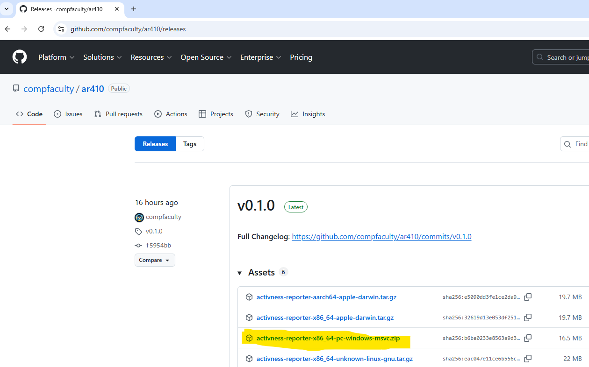
*Open the correct release page and start downloading.*

### Step 2
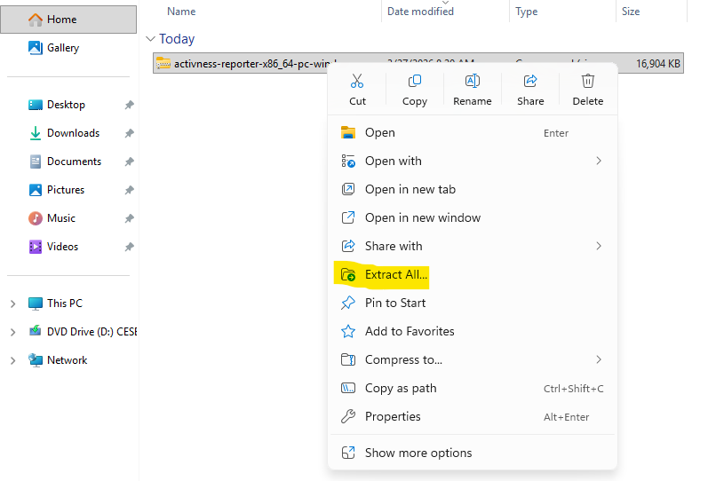
*Pick the correct archive for your OS.*

### Step 3
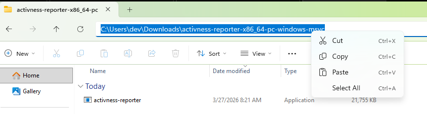
*Save the archive to a folder you can find easily.*

### Step 4
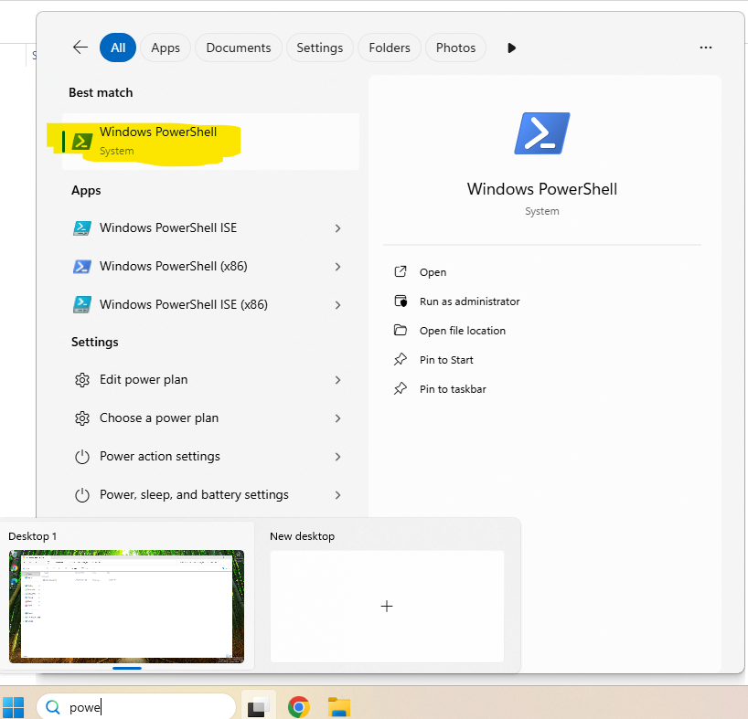
*Extract all files from the downloaded archive.*

### Step 5
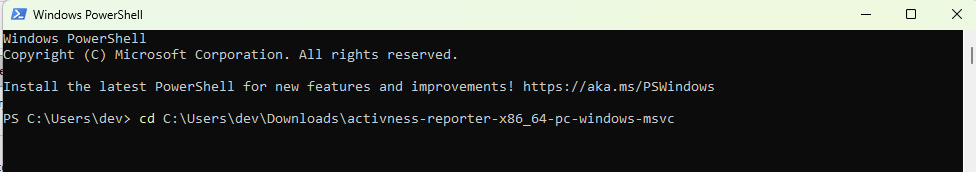
*Open extracted folder and locate `activness-reporter.exe`.*

### Step 6
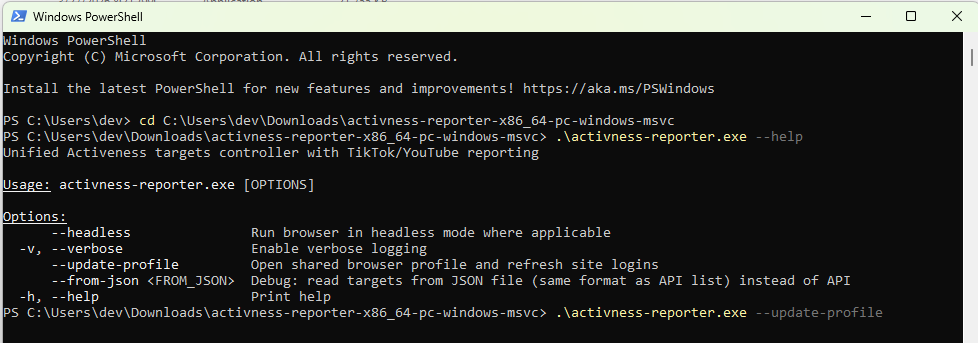
*Create or edit `.env` with your account credentials.*

### Step 7
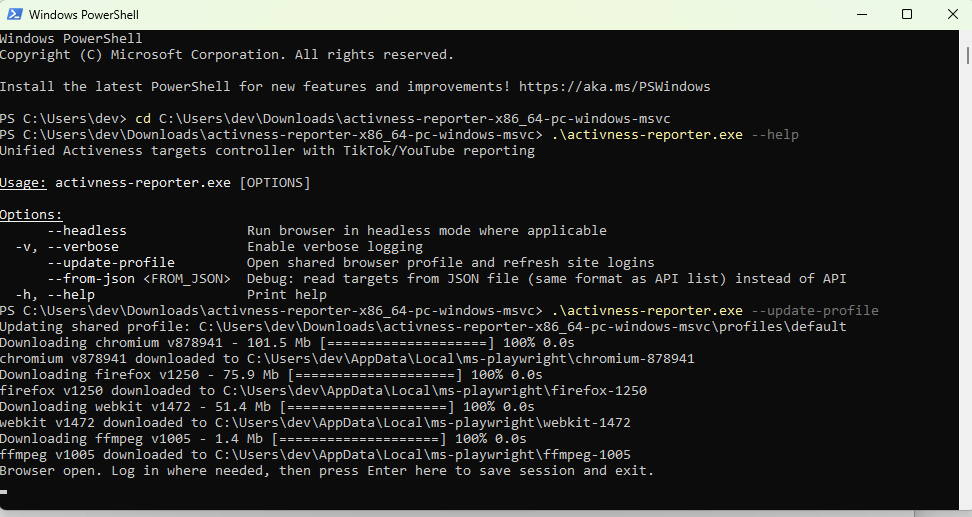
*Double-check the `.env` file name is exactly `.env`.*

### Step 8
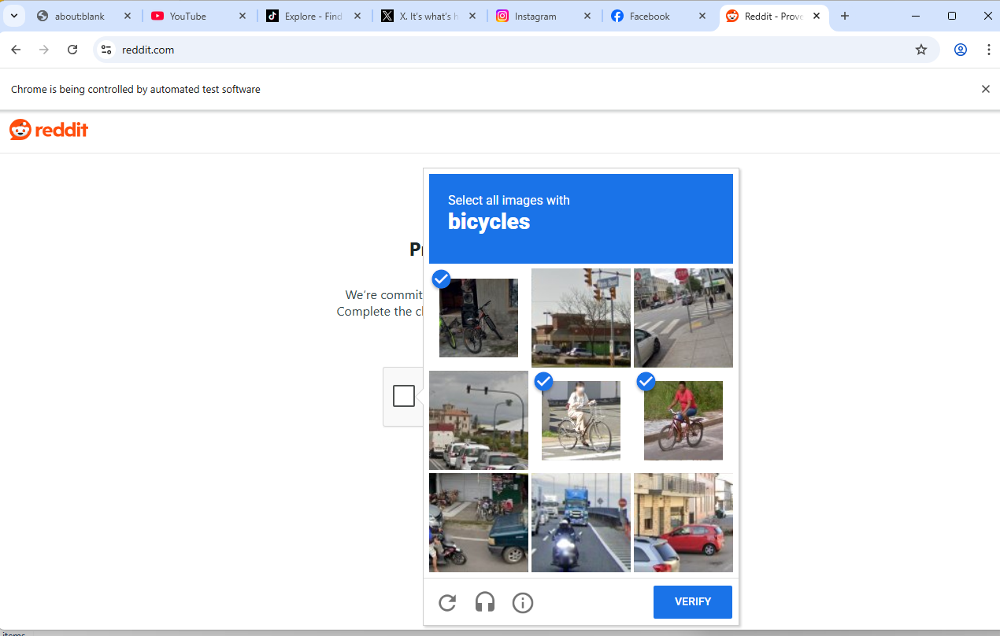
*Open PowerShell in the same app folder.*

### Step 9
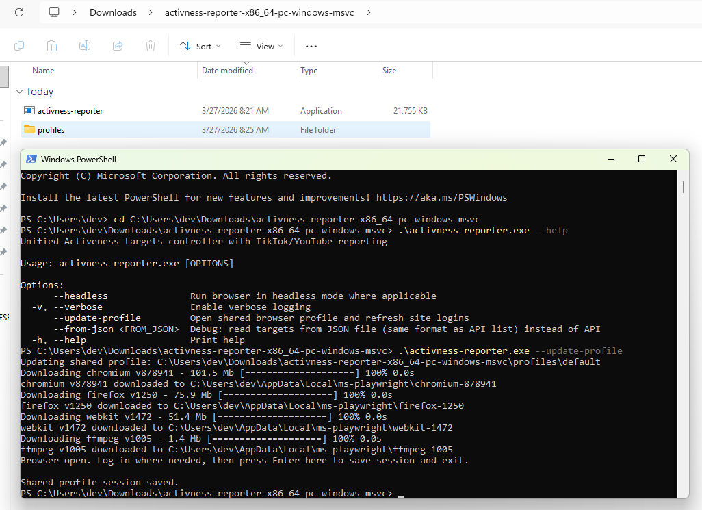
*Run the app command from that folder.*

### Step 10
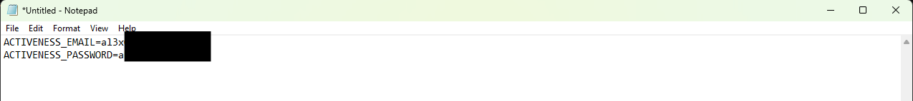
*Wait during first startup while dependencies initialize.*

### Step 11
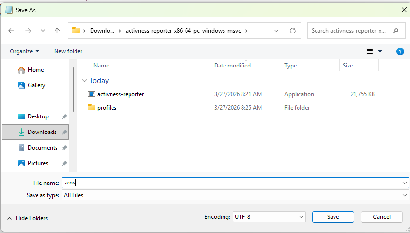
*Confirm login and target loading steps complete.*

### Step 12
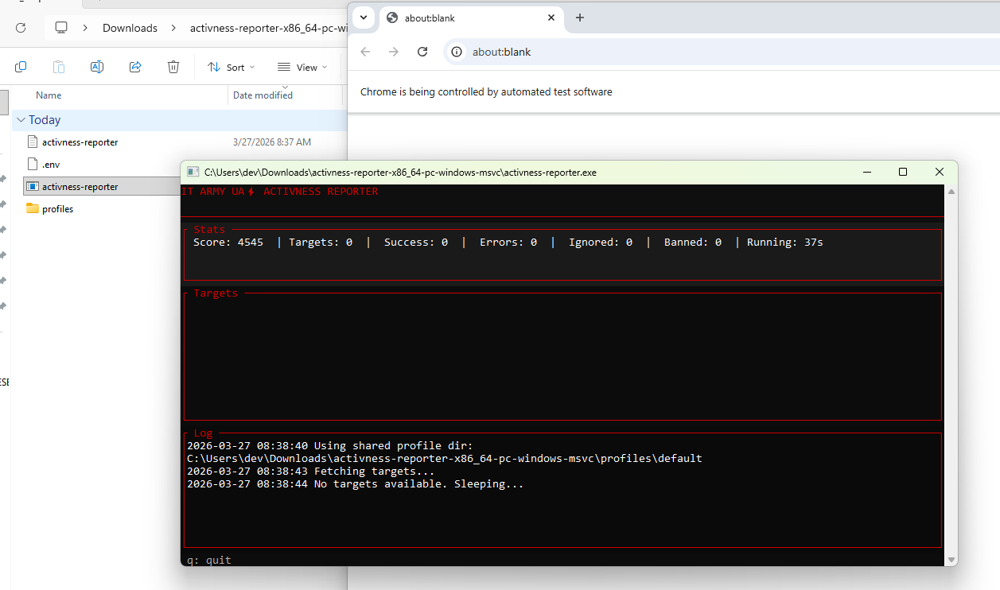
*Check the workflow is progressing without errors.*

### Final screen (running app)
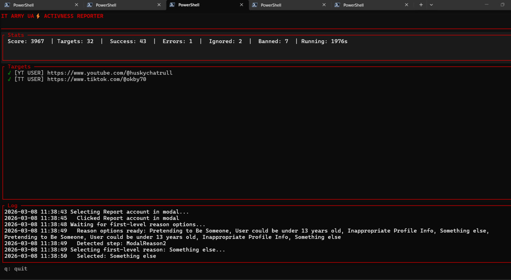
*Expected running state of `activness-reporter` (final result).*
